# The MTG Color Wheel (& Humanity)

> **Citation:** This document is a local reference copy of the original article by **Homo Sabiens**, published on Substack on 2024-01-07.
>
> **Original source:** [https://homosabiens.substack.com/p/the-mtg-color-wheel](https://homosabiens.substack.com/p/the-mtg-color-wheel)
>
> All credit for this work belongs to the original author. This copy is maintained here for convenient reference as part of the MTG Knowledge Complex project.

---

*Author’s note:* Medium put [the original color wheel article](https://humanparts.medium.com/the-mtg-color-wheel-c9700a7cf36d) (with its 19,000 claps!) behind a paywall without my permission and without me being able to change it, so I’m rehosting/reposting here.  Bonus: it’s been updated with, like, 7% new additional content and some small corrections and improvements!

---

### Background

Magic: the Gathering is a fantasy card game by Richard Garfield, Ph.D. and Wizards of the Coast centered on a “color wheel” in which five distinct colors in a particular order represent five different flavors of magic. How this works in actual gameplay is irrelevant to this post, which instead exists to explore the *philosophy* of the MTG color wheel, and how that philosophy is a near-enough-to-be-thought-provoking match for reality.

Personalities, organizations, goals, and means can all be thought of in terms of the Magic colors they typify, allowing you to draw interesting connections, make surprisingly useful predictions, identify deficits and growth areas, and increase empathy. I claim that the Magic system, which was *designed* to be resonant and trope-y and archetypal, does a lot of the same good work that [naming things](https://www.lesswrong.com/posts/PCrTQDbciG4oLgmQ5/sapir-whorf-for-rationalists) does, and is a richer intuition pump than other popular wrong-but-usefuls like Enneagram or MBTI or chakras or the integral theory colors.

Everything I write becomes free after a week or two, but it’s only *paid* subscriptions that make it *possible* for me to write. If you found anything of value in this or any of my other writing, please consider dropping a coffee’s-worth of money here; every bill I can pay with writing is a bill I *don’t* have to pay by doing other stuff instead.

---

### WUBRG (pronounced “woo-berg”)

Below are the five colors of Magic: white, blue, black, red, and green.

Each color has a *central goal,* and a *default strategy.*

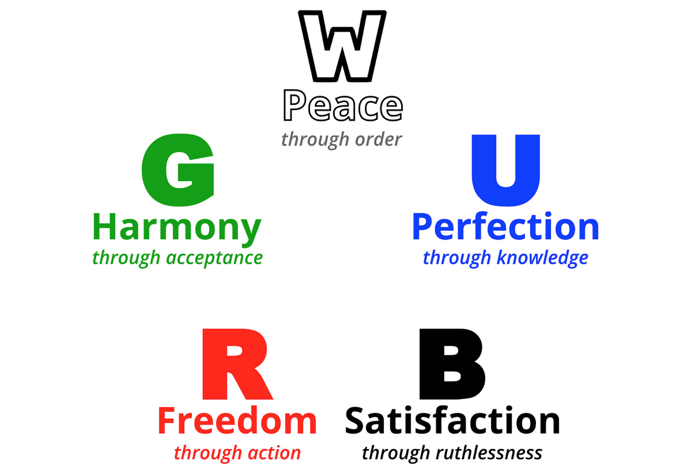

---

### White

**White** seeks *peace,* and it tries to achieve that peace through the imposition of *order. *White believes that the solution to all suffering and unhappiness is coordination and cooperation and rules and restraint. The archetypal white organization would be a church, and a white dystopia would be a fascist regime such as the one in George Orwell’s *1984*, or a stagnant society like the one in Lois Lowry’s *The Giver.*

*The “white mana” symbol (™ and © Wizards of the Coast)*

Central examples of white characters from pop culture include Brienne of Tarth from *Game of Thrones*, Javert from *Les Misérables, *Ozymandias from *Watchmen,* Superman, McGonagall from *[Harry Potter and the Methods of Rationality](http://hpmor.com/)*, and Marge from *The Simpsons. *In the actual game of Magic, white cards are angels and knights and clerics and loyal steeds, healing spells and protective auras and laws that bind all parties equally, and anthems that strengthen all of your allies at once.

A white agent, when presented with a decision or quandary, asks *what is the **right **course of action to take,* where “right” depends on their moral or cultural framework.

Victory for a white agent feels like brightness, purity, exaltation — a clean breeze sweeping across a high plain under a bright sun. Defeat feels like watching the corrosion creep forward, the great monuments crumble, or the enemy pouring over the gates, knowing that the goodness of the world is unraveling.

**Other words associated with white:*** authority, compassion, community, contribution, fairness, happiness, honesty, justice, kindness, leadership, peace, religion, responsibility, security, service, trustworthiness, altruism, cleanliness, commitment, consistency, duty, conviction, courtesy, dedication, discipline, endurance, gratitude, honor, integrity, patience, poise, respect, teamwork, tradition, unity, valor, honor, formality, generosity, protectiveness, asceticism, authoritarianism, morality, fanaticism, intolerance*

From most to least, white agents have the following Big Five traits:

- Conscientiousness (++)
- Agreeableness (+)
- Extraversion (~)
- Neuroticism (-)
- Openness (--)

From a negative perspective, white *craves order.*  It needs certainty, predictability, clear expectations.  Rules.  Clear distinctions.  *Justice.*  White struggles with ambiguity and nuance, and doesn’t do a good job of stepping outside of its own frame or perspective.

A white agent, when injured or disoriented or low-resourced, will tend to *double down* on structure—trying to force things into place, ignoring or attacking anything that threatens to not-fit its preconceptions.  And with *too much* white, things ossify, freezing into suffocating unchangeability, rituals that are empty of meaning and have lost their original purpose.

---

### Blue

**Blue** seeks *perfection,* and it tries to achieve that perfection through the pursuit of *knowledge.* Blue believes that things could be almost arbitrarily good if we could all just figure out the truth, and then apply that understanding to its fullest extent. The archetypal blue organization would be a university or a research lab, and a blue dystopia would be one in which efficiency were pursued without morals or limits*,* or in which intelligence were the sole axis of a meritocracy.

*The “blue mana” symbol (™ and © Wizards of the Coast)*

Merlin is a classic blue character, as are Spock from *Star Trek* and Dr. Manhattan from *Watchmen.* Lisa from *The Simpsons* is blue, and Ravenclaw House from *Harry Potter* exists to serve blue students. Interestingly, there’s a strong argument that Spongebob Squarepants is at least partially blue, despite not being particularly intelligent or competent, because he’s often *driven* by his curiosity and his desire for perfection.  Harry James Potter-Evans-Verres in *[HPMOR](http://hpmor.com/) *is more than one color, but his projects with Hermione and Draco are strongly blue-leaning. In MTG, blue cards are wizards and faeries and monsters of the deep, counterspells and illusory tricks, magic that accumulates knowledge and incremental advantage and undercuts, rather than directly opposing (brains over brawn and mind over matter).

A blue agent, when presented with a decision or quandary, asks *what course of action makes the most **sense**, *where “sense” is determined by careful thought and the application of knowledge and expertise.

Victory for a blue agent feels like clarity, revelation, actualization, conclusion — a final puzzle piece clicking into place, or the last note of a perfect symphonic performance. Defeat feels like everything is slippery, foggy, intractable (and will be evermore), like there’s no path forward and nothing to be done, like all of the potential is wasted and all of the confusion is permanent.

**Other words associated with blue:*** challenge, competence, creativity, curiosity, knowledge, optimism, accuracy, adaptability, awareness, brilliance, cleverness, concentration, development, efficiency, foresight, imagination, insight, logic, quality, rigor, trickery, strategy, service, truth, vision, wonder, perception, nuance, aspiration, focus, invention, patience, wordplay, rationality, subtlety, scholarship, absent-mindedness, cerebral, deception, enigmatic, skepticism, aloofness*

From most to least, blue agents have the following Big Five traits:

- Openness (++)
- Conscientiousness (+)
- Extraversion (~)
- Agreeableness (~)
- Neuroticism (-)

From a negative perspective, blue *craves clarity.*  Its need to see and understand and optimize can become frantic, like a child clutching a stuffed animal—even if knowledge won’t *do* anything, won’t allow for any new actions or help in any way, blue will often scrabble for it, even at the expense of other stuff that *would* help.  A blue agent, when injured or disoriented or low-resourced, will often *perseverate,* spinning its wheels on irrelevant questions or tinkering with trivialities as a way to avoid having to engage with the big things it doesn’t understand and doesn’t feel ready for.

And with *too much* blue, everything not easily quantifiable can evaporate or suffocate.  Pathological blue is *dismissive* of that which it doesn’t understand or can’t sufficiently explain.  Out-of-balance blue often disregards large swathes of what matters, and that disregard grows louder and more insistent as the situation worsens.

---

### Black

**Black** seeks *satisfaction,* and it tries to achieve that satisfaction through *ruthlessness. *Black wants power and agency so that it can act upon its preferences at any time, doing whatever it wants, whenever it wants, and reshaping the world around it as it sees fit.. It recognizes no limits upon this pursuit except those which emerge from its own desires and self-interest. It is capable of cooperation and alliance, but only consequentially, as in game theory; at its core, black is amoral, not immoral, since it doesn’t think morality is even really a Thing. The archetypal black organization would be a hedge fund or a startup, and a black dystopia would be a totalitarian dictatorship.

*The “black mana” symbol (™ and © Wizards of the Coast)*

In the first *Star Wars* film, Han Solo was a sympathetic black character, whereas in *Game of Thrones* Cersei Lannister is a black villain. Every major character in *Seinfeld* is black except Kramer, and both Bart Simpson and Slytherin House embrace and embody black ideals. Blaise Zabini and Sirius Black are black characters in *HPMOR. *In the game of Magic, black cards are vampires and necromancers, demons and horrors, kill spells and resurrection spells and sacrificial spells that trade life and creatures for power and pain.

A black agent, when presented with a decision or quandary, asks *what’s best for me?*  What course of action will leave me best off, where “best off” includes having power, influence, safety, and wealth, as well as having moved closer to one’s goals.

Victory for a black agent feels hefty, exultant, and satisfying, like a bag of gold coins or a heavy hammer — it’s the feeling you have when you know that the game is won, even if you haven’t yet crossed the finish line. Defeat, on the other hand, feels like aging or imprisonment — like scrabbling against an unscalable wall behind which your dreams are turning to ash and trickling away, leaving you with nothing.

**Other words associated with black: ***achievement, autonomy, determination, fame, influence, pleasure, popularity, reputation, success, status, wealth, ambition, control, dignity, excellence, improvement, innovation, liberty, mastery, performance, power, self-reliant, talented, undaunted, decisive, relentless, industrious, persuasive, realistic, suave, competitive, political, proud, solitary, uninhibited, amoral, arrogant, calculating, egocentric, hedonistic, malicious, opportunistic*

From most to least, black agents have the following Big Five traits:

- Openness (+)
- Extraversion (~)
- Neuroticism (~)
- Agreeableness (-)
- Conscientiousness (--)

(Although that last one is complicated; black is low on *shoulds* but is quite capable of diligence and effort when it feels like it.)

From a negative perspective, black can’t handle codependency or obligation.  It starts to freak out if it feels penned-in, depended-upon, trapped, *drained.*  A black agent, when injured or disoriented or low-resourced, is extremely loath to cooperate, to invest, to engage in interactions that don’t visibly and immediately pay off.  Black needs a feeling of power and possibility and potential, and when that’s missing or threatened, it tends to shift *even harder* into a kind of short-sighted transactional mode, often driving away precisely the people and opportunities that would have helped.  With *too much* black, concepts like “cooperation” and “sustainability” drop away—black-out-of-balance is like a wildfire, consuming everything as quickly as possible, sowing the seeds of its own suffocation.

---

### Red

**Red** seeks *freedom,* and it tries to achieve that freedom through *action.* Red wants the ability to live in the moment and follow the thread of aliveness and passion. It’s a bit strange to speak of a red “organization,” but to the extent that it’s *possible *to have an archetypal red organization, it would be one of those art studios that’s owned by no one where there’s paint on every wall and it’s almost impossible to move around what with all of the dancing and debating and half-finished projects. A red dystopia, on the other hand, would simply be anarchy.

*The “red mana” symbol (™ and © Wizards of the Coast)*

Red characters in popular culture include Toph Beifong from *Avatar: The Last Airbender*, Wile E. Coyote from *Looney Toons*, both Romeo and Juliet, and Kramer from *Seinfeld.* Of the Simpsons, Homer is the one who best embodies the spirit of red. The character of Joyce Byers in Stranger Things (Winona Ryder’s character) is loudly embodying red through both the first and second seasons. In Magic, red cards are goblins and pyromancers and dragons, Lightning Bolts that burn the opponent, illusions that taunt and enrage their allies, spells that grant speed and haste and fragile power, desperate gambles that put everything on the line, and chaotic effects that upset the whole battlefield.

A red agent, when presented with a decision or quandary, asks *what do I **feel **like doing? *Which path seems most alive?  What does my heart tell me?

For a red agent, victory feels fiery, beautiful, magnificent, and fierce — it’s the climax of a dance or a brawl or a love affair, the feeling of cresting a summit or having successfully ridden a wave. It’s feeling *alive.* Defeat for a red agent is correspondingly quiet, empty, and gray — being trapped by things you can’t even pinpoint, to rail against; having nothing to love, nothing to do, nothing to be; feeling nihilism and pointlessness slowly swallowing you whole.

**Other words associated with red: ***authenticity, adventure, beauty, boldness, friendship, fun, humor, loyalty, candor, courage, creation, drive, empathy, enthusiasm, ferocity, independence, individuality, irreverence, joy, originality, passion, purpose, sensitive, spontaneous, trusting, dramatic, flexible, forthright, casual, stubborn, angry, blunt, careless, reckless, destructive, fickle, flamboyant, impulsive, performative, poetic*

From most to least, red agents have the following Big Five traits:

- Openness (++)
- Extraversion (+)
- Agreeableness (+)
- Neuroticism (~)
- Conscientiousness (--)

(As with black, red is capable of sustained diligent effort, but only if intrinsically motivated; no conscientiousness *for conscientiousness’s sake.*)

From a negative perspective, red is pathologically incapable of accepting limitations—the sort of person who’s unable to marry because they’re unable to *commit,* because committing means cutting off avenues of future possibility.  It’s also unable to tolerate quietness, emptiness, boredom, ennui.  Red is *restless,* needing independence, freedom of movement, a sense of unconstrained choice, *passion.*

A red agent, when injured or disoriented or low-resourced, will tend to *flail* or *explode,* magnifying and amplifying its emotions and then following them wherever they lead (and *justifying* the actions it takes as being valid and unimpeachable *because* they came from the heart).  Red, fearing a loss of freedom and direction, responds by breaking everything around it and driving as hard and fast as it can in whatever direction it happens to be facing.  With *too much* red, there’s no pattern, no ground to stand on, no reliability, no predictability.

---

### Green

**Green** seeks *harmony,* and it tries to achieve that harmony through *acceptance. *Green is the color of nature, wisdom, stoicism, taoism, and destiny; it believes that most of the suffering and misfortune in the world comes from attempts to cast off one’s natural mantle, step outside of one’s natural role, or fix things which aren’t broken — it’s the color of Chesterton’s Fence. It seeks to embrace what *is, *harmony as distinct from order* — *the archetypal green organization would be a hippie commune, or the pop culture interpretation of a Native American tribe (such as in Disney’s *Pocahontas)*, while a green dystopia would be something like the society in *Divergent* or a tribe with absolutely rigid traditions and an unchanging and unchangeable relationship to its environment.

*The “green mana” symbol (™ and © Wizards of the Coast)*

Green characters are slightly harder to find in the role of the protagonist, but often crop up around the edges of a story. If green had a martial art, it would be aikido — a sort of bending, accepting formlessness backed by subtle power. Both Yoda from *Star Wars* and Guinan from *Star Trek* are green, as is Tom Bombadil from *Lord of the Rings. *Buffy (the vampire slayer) has other colors but moves toward green as she embraces her destiny and, on the more feral side, Wolverine from *X-Men *often acts from green. The centaur society in *HPMOR* is green, in that they had sworn not to set themselves against destiny, even if it meant the end of all things. Our last Simpson, Maggie, is green as well, but that’s got more to do with her age than her fundamental character. In the game, green cards are druids and sages, mighty monsters and howling wolves, auras that restore the natural order and regenerate the wounded, and bursts of magic that produce enormous, feral strength or quell entire battles.

A green agent, when presented with a decision or quandary, asks *how are these things usually done? What is the established wisdom?*

Victory for a green agent feels peaceful, fertile, and balanced — a tired general retiring to his farm, a mother nursing her baby, a valley lush with growth now that the rains have come and the pestilence has passed. It’s solemn, but without sadness; joyful, but without ego. Defeat, on the other hand, feels like having no ground beneath your feet, like being cut off from your tribe and family, like watching fair and fragile goodness being crushed underfoot and having everything you thought was true called into question.

**Other words associated with green:*** growth, harmony, respect, spirituality, stability, acceptance, calm, centered, cautious, common sense, contentment, experienced, humility, intuition, maturity, meaning, moderation, restraint, reverence, serenity, sharing, significance, simplicity, strength, vigor, agreeable, contemplative, hearty, barbaric, virile, well-adapted, conservative, traditional, eldritch, ancient*

From most to least, green agents have the following Big Five traits:

- Agreeableness (++)
- Conscientiousness (+)
- Extraversion (+)
- Neuroticism (-)
- Openness (--)

From a negative perspective, green is pathologically passive.  It has too much faith in everything working out, in things being the way they should be, in accepting *whatever* comes, however horrible.  It can be phlegmatic to a fault, passing up opportunities to save itself and refusing to prepare for predictable, oncoming change.  Green struggles with *taking a stand,* and is suspicious of any kind of novel agency.

A green agent, when injured or disoriented or low-resourced, will often surrender or give up, turning to blind faith or repeating its default actions over and over again, unable to try something new.  Worse, out-of-balance green will often undermine or sabotage *others’* attempts to salvage a situation, dragging everyone else down with it.  Green tends to fall back on what it already knows, regardless of whether that’s appropriate.  And with *too much* green, all distinctions between good and bad, or better and worse, fall away, and everything becomes gray and indistinguishable.

---

On the flip side, a world *without* white is a world of unreliability, with no scaffolds or handrails, no rules or recourse, no sense of fairness and no moral compass. White is the hard and durable skeleton of society, and without it, much of the cooperation and coordination that we rely and depend upon vanishes — even things like driving on a particular side of the road.

A world without blue is a world without curiosity, without investigation, without the nitpicking desire to get every cog into *just* the right place. More than any other color, blue represents what makes humanity *different* from other animals, other species — without it, we sink back into the present and lose our bridge to the future.

A world without black is a horror show of codependency, with all the inefficiencies of communist Russia and all of the insipid conformity of the town in *Footloose* or the society in *Equilibrium* or the people in the parable of the Emperor’s New Clothes. It’s a place where the sovereignty and nobility of the individual vanishes beneath the weight of the collective — it looks good at first, but without black, you lose the will to empire, the thirst for recognition, the desire to get ahead, the deep and personal wants that define and shape a person’s whole destiny. What’s left is pleasant, but there’s no soul at the core of it — nothing that burns with the hunger for something *more.*

A world without red lacks a different sort of fire — it’s a world that has wanting, but no *passion…*only a base and selfish grasping, with no real spark behind it. It’s a world where the rules never change, where the assumptions are never questioned, a world without teenage love and modern art and violent protests and spur-of-the-moment adventures. Without red, everything moves in slow motion and everything has its temperature turned down — like an entire society that’s been sedated.

A world without green, on the other hand, is a world unmoored from reality and disconnected from its own history. It’s a world full of bold schemes that fail to pan out, disasters that take generations to build momentum but are noticed too late. It’s a world where everything is out of place — where nothing truly even *has* a place — a constant parade of divorces and suicides and famines and extinctions, where things like global warming and eugenics and welfare programs with misaligned incentives happen *all the time.* It’s a world where the qualities that people derive from Zen Buddhism, or from the contemplation of a sunset, or from a hike in the mountains, or from the embrace of a grandmother, or from the sermon of an ancestor, are all entirely absent. It’s a place where you eat and eat and eat, but you never feel truly *full.*

---

### Colors in Conflict

Another way to define the colors is to look at their disagreements with one another.  There are five central *conflicts* between colors on opposite sides of the wheel, which help to define them in contrast with their enemies.

In earlier versions of this essay, I defined the conflicts using pairs of words like “order versus chaos,” or “preservation versus exploitation.”  Attentive readers pointed out, though, that defining a conflict as *order versus chaos* is pretty overtly taking a position on that conflict!  It’s rather like the choice to define a guerilla group as “terrorists” or “freedom fighters” … the terminology you use is often downstream of having already chosen a side.

So below, I’ve defined each conflict three times—once through the eyes of each of the colors involved, and once with a more neutral summary.

---

#### White vs. Black

From white’s perspective:
Good vs. evil

From black’s perspective:
Individualism vs. codependency

From a neutral(ish) perspective: The good of the group vs. the good of the individual

White and black disagree about whether the individual exists to serve the group, or whether the group exists to serve the individual.  White prioritizes the greater good, even where it calls for sacrifice, and black does the opposite.  From white’s perspective, if you put yourself over the group, you’ve *actively defected,* whereas from black’s perspective, it’s the group’s job to *earn* your allegiance and support; [white thinks the default choice is “stag” and black thinks the default choice is “rabbit.](https://www.lesswrong.com/posts/zp5AEENssb8ZDnoZR/the-schelling-choice-is-rabbit-not-stag)”  The phrase “all for one and one for all” is white, whereas the spirit of individual sovereignty expressed in Ayn Rand’s philosophy is black. From white’s perspective, black is selfish and evil; from black’s perspective, white is naive and coercive.

#### Black vs. Green

From black’s perspective:
Pragmatism vs. waste

From green’s perspective:
Preservation vs. exploitation

From a neutral(ish) perspective: Take it or leave it

Black and green disagree about the relationship between the individual and the surrounding environment. Green is the color of evolution and thriving, and believes in balance and evolved order, wanting to preserve the natural status quo. Black, on the other hand, sees unclaimed potential waiting to be unlocked.  What green would call preservation, black would call waste and hesitation; what black would call use or consumption, green would call exploitation.  From green’s perspective, black is short-sighted and unbalanced; from black’s perspective, green is stagnant and irresolute. A black agent might try to create a strip mine; a green agent is more likely to build an animal sanctuary.

(If you’re interested, the book *Ishmael,* by Daniel Quinn, is a deep dive into the green-black conflict in modern human society, written from green’s perspective; that’s where I got the “take it or leave it” dichotomy.)

#### Green vs. Blue

From green’s perspective:
Equilibrium vs. destabilization

From blue’s perspective:
Complacency vs. optimization

From a neutral(ish) perspective: Nature vs. nurture

Green and blue disagree on questions of determinism and free will. Green believes that there is a niche for everyone, and that genetics and environment determine personality and potential. Blue believes in “tabula rasa,” and holds to the claim that anyone can become anything, given the proper nurturing, education, and opportunity. In line with this, green believes the system is subtle, complex, and interconnected, and that *messing* with it is unwise, and likely to lead to disaster, whereas blue believes this just means you need to science harder to understand all of the relevant dynamics.  From green’s perspective, blue is hubristic and unwilling to hear the wisdom of the ages, caught up in its Sisyphean pipe dreams; from blue’s perspective, green is complacent and stuck in its ways.

(You may be noticing echoes of criticisms, such as blue and black each harboring similar dissatisfactions with green. This is a feature, not a bug; blue and black are *allies *and part of that alliance is a shared frustration with their common enemy. More on this below.)

#### Blue vs. Red

From blue’s perspective:
Clear thinking vs. short-sighted reacting

From red’s perspective:
Warm aliveness vs. cold heartlessness

From a neutral(ish) perspective: Reason vs. emotion

Blue and red disagree about strategy and tactics. Blue believes that the best results will be achieved if you think carefully and let reason and logic carry the day, while red believes that it’s too easy to waste time and talk yourself in circles, and that you should instead follow your heart and listen to your gut. Blue sees red as impulsive and rash; red sees blue as repressed and unfeeling and unwilling to act.

#### Red vs. White

From red’s perspective:
Freedom vs. constraint

From white’s perspective:
Chaos vs. order

From a neutral(ish) perspective: Structure vs. flexibility

Red and white disagree on questions of commitment and consistency. Red is episodic, suspicious of rules and order because they constrain one’s ability to grow and change and make free choices in accordance with what you truly want (as opposed to what you feel obligated to *pretend* to want). White is more diachronic, interested in finding the small compromises and sacrifices that will allow people to build trust and cooperate reliably. Where red sees cages, white sees scaffolds, and vice versa.

---

Considering where you fall on each of these disagreements can help you pin down which colors are more-you and which are less; places where you feel like it’s impossible to take a side (because it’s too complex, or because it depends, or because both have a solid point) indicate that you have similar allegiance or non-allegiance to both colors at once.

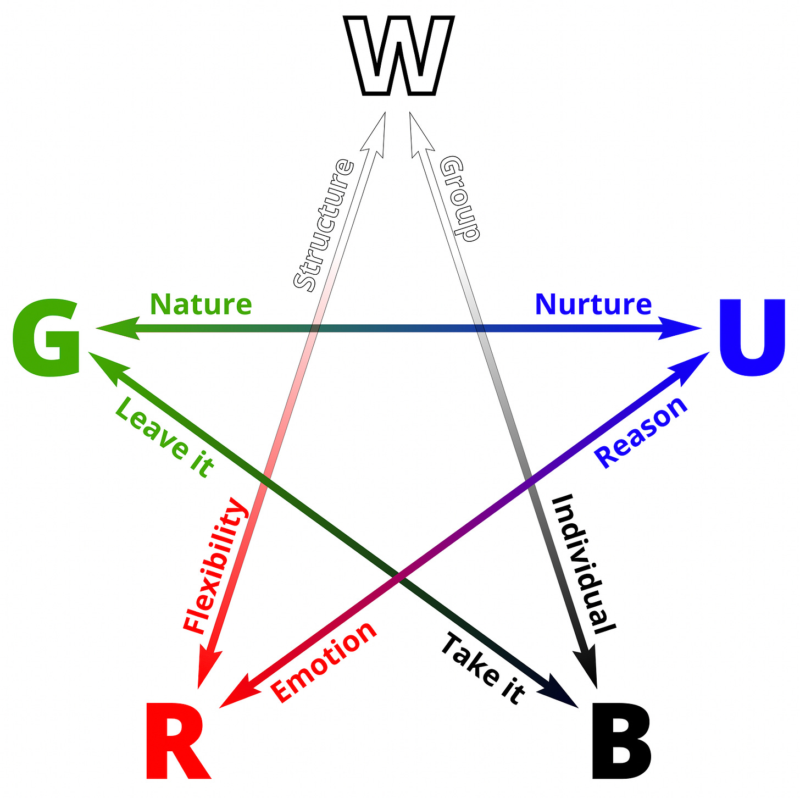

These disagreements also help shine a light on the tension between *allied* colors.  Adjacent colors (like green and white) tend to have a lot in common, but *their other allies* are enemies (green is allied with red, which is enemies with white’s ally, blue).  To the extent that green and white disagree, that disagreement echoes the disagreement of red and blue: green is wilder and less committed to structure and consistency; white (like blue) is more willing to subordinate instinct and emotion to structure and reason.  Green thinks that order ought to be *emergent*, rhyming with the frenetic nature of red, whereas white thinks it needs to be *imposed,* rhyming with the engineering spirit of blue.

Similarly, white and blue disagree about sovereignty, with white siding with green and subordinating the individual to the group, and blue siding with black and thinking of groups as instrumentally rather than terminally valuable.

Blue and black disagree about the importance of systems and structures in a way that rhymes with the disagreement between white and red, with black more willing to wing it.

Black leans more toward trickery and artifice and deception, along with blue, whereas red leans more toward guilelessness and being genuine, along with green.

Red and green disagree over roles and destiny, with red wanting to buck the niche that green has ready for it in a way that echoes black, and green sharing white’s willingness to be prescriptive.

---

### Allies in Arms

To understand what the adjacent colors *agree* on, look at what they *both* disagree with their mutual enemy about.

#### WU

White and blue are the enemies of red, which they see as unfettered and chaotic. White and blue both agree that something like *design* is important — structure, engineering, intentionality, planning, carefully figuring out how all the pieces fit together.  White is bought-in to the concept of design because an orderly system reduces the risk of confusion and conflict, and blue because cleanliness and clarity make possible deep investigations and long-term or delicate optimization. Jean-Luc Picard from *Star Trek* is an excellent example of a white/blue archetype, as is the political persona of Hillary Clinton.

*(The colloquialism for W/U in the game of Magic is “Azorius.”)*

A white/blue agent asks the question *how do we **know** what’s right and good? *The whole concept of a “[rationality technique](https://www.lesswrong.com/s/KAv8z6oJCTxjR8vdR)” is extremely white/blue — the idea that we might create carefully defined, algorithmic heuristics for doing things better according to some outside standard is not one that other color combinations are likely to produce. Effective Altruism is also a white/blue movement, though it makes efforts to reach out to red (compassion) and black (taking the long view on self-interest).

#### UB

Blue and black are the enemies of green, the color of tradition, which they see as complacent and passive. Black is more about *taking* and blue is more about *optimizing,* but both of them agree that green’s hands-off attitude is a silly hangup.  Blue and black both agree on *growth mindset* — the idea that one is not defined by one’s origins or constrained to the role society has set. Blue/black characters are often intelligent, clever, arrogant, and aloof, and unimpressed with the way things have always been done — notable examples include Odysseus from *The Odyssey*, Sherlock Holmes, Lex Luthor, and Quirinus Quirrell from *HPMOR*.

*(The colloquialism for U/B in the game of Magic is “Dimir.”)*

A blue/black agent asks the question *how can I **best** achieve my goals? *It’s fair to describe the blue/black philosophy or attitude as belief in the value of “enlightened self-interest,” which is why it’s not surprising to find it overrepresented in communities like LessWrong and Silicon Valley, which see themselves as attempting to disrupt the status quo for the better. Transhumanism is a fundamentally blue-black worldview, in opposition to the green imperative to accept death as a crucial and inevitable part of life.

#### BR

Black and red are the enemies of white, which they see as invasive and tyrannical. Black and red both agree that *independence* is something to be fostered and defended — red in an attempt to avoid coercion or pressure and soul-sucking monotony, and black out of a desire for self-reliance and agency and the reshaping of things to its satisfaction. Many black/red characters lean evil, such as the Joker from *Batman* and Voldemort from canon *Harry Potter*, but the combination can also be one of impishness or chaotic selfishness, as with Peter Pan, Deadpool, or Cap’n Jack Sparrow. Achilles from *The Iliad* is black/red, as is the political persona of Donald Trump and the protagonist of *The Fountainhead, *Howard Roark.  Coming at it from a slightly different direction, the half-vampire vampire hunter Blade is a black-red hero, motivated almost entirely by his fury and his desire for revenge.

*(The colloquialism for B/R in the game of Magic is “Rakdos.”)*

A black/red agent asks the question *how do I get what I **want**? *Because of its dismissive attitude toward judgment and social mores, black/red is often the combination of endorsed hedonism and “live and let live.” The BDSM and kink communities are fundamentally black/red, for example, with many of their norms intended to facilitate the healthy expression of urges and desires that are delegitimized and disincentivized in broader society.

####
RG

Red and green are the enemies of blue, which they see as icy, disconnected, shut-down, and cerebral. Red and green both agree on the importance of *authenticity* — green from a place of wildness and immediacy and gut instinct, and red from a place of passion and self-actualization and following the heart. Dionysian archetypes are red/green, as is Tinkerbell and the Hulk, and the parts of Wolverine that *aren’t* green are usually red. On the gentler side of things, Aang from *Avatar: The Last Airbender* is firmly red/green and is often torn between his innate red playfulness and the gravity and responsibility required of his green role and destiny.

*(The colloquialism for R/G in the game of Magic is “Gruul.”)*

A red/green agent asks the question *where am I now, and where should I go?* A real-life activity that embodies red/green is Circling (à la the Authentic Relating community), which in part emphasizes setting aside narratives and frames and just being *present*, in the moment, with yourself and other people.

#### GW

Green and white are the enemies of black, which they see as selfish, short-sighted, and ultimately self-defeating. They both agree on *community* — that the whole can be greater than the sum of its parts, and that there are things larger than oneself that are worth sacrificing for. Hufflepuff House from *Harry Potter* is a green/white institution, and Akela from *The Jungle Book* is a green/white archetype. Other examples of people and characters in this space include Confucius, Jesus, Rufio from *Hook*, and Obi-Wan Kenobi (as played by Alec Guinness).

*(The colloquialism for G/W in the game of Magic is “Selesnya.”)*

A green/white agent asks the question *what’s fair and good? What is **sustainable?***Green/white institutions tend to be centered around compassionate endeavors, but if they go astray it’s in the direction of well-meaning lost purposes and wasted signaling — a lack of blue’s epistemic hygiene — rather than in the direction of cold, heartless efficiency or relentless pursuit of knowledge or the bottom line. GW institutions include the YMCA, Habitat for Humanity, Teach for America, the Lions’ Club, Meals on Wheels, the Boy Scouts and the Girl Scouts, and most small-town churches — basically any organization whose primary purpose is to foster the web of connection between people and to maintain the society’s culture. Some of the institutions above may lean in the direction of red or blue, but they’re *primarily* green/white.

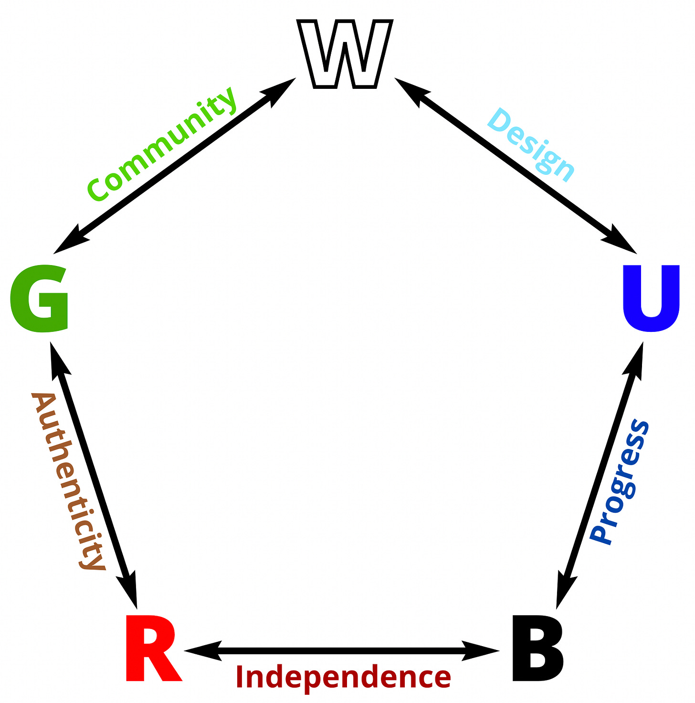

In addition to serving as a foil for its enemies, each color can also serve as a bridge connecting its two allies. White ties together the orderly tendencies of green and blue, (though green and blue disagree on *how* that order should come to be, with green believing in emergent order and blue believing in engineered order).

Blue epitomizes careful planning, which both white and black approve of. Black’s focus on personal agency and personal satisfaction rhymes with blue’s desire for perfection and red’s desire for freedom. Red’s spontaneity lies in a middle ground between green’s wildness and black’s egocentrism. And green’s serenity ties into the fundamental belief that life is good, which is shared by both red and white.

---

### Opposites in Harmony

Just as allied colors can disagree with one another, so too can enemy colors find common ground and productively combine their strengths.

#### WB

The enemy colors white and black combine to form *tribalism* — the “us versus them” mentality*. *Think Don Corleone and the other gangsters from *The Godfather *— a strict system of codes and honor within the group, and almost total impunity with outsiders. Other fictional examples of white/black include the character Rorschach from *Watchmen *(who would probably also get along with the Punisher), Magneto from *X-Men,* and James Bond.

*(“Orzhov”)*

A white/black agent asks the question *who’s in my circle of concern? *In our own society, the two major political parties have *absolutely* become white/black in their motivations in recent years, with the most disappointing example being the Republican party’s unwillingness or inability to do anything about the excesses of the president. You can also see the white/black ingroup-outgroup dynamic in certain swaths of social justice culture — there are activists who implicitly hold a scarcity mindset and believe that social progress is largely a zero-sum game, and thus react poorly when other causes threaten to steal the spotlight and siphon off society’s attention, sympathy, and resources.

(Note that “tribalism” is more *a *thing that can describe the W/B philosophy than *the* thing. There’s variability in any specific framing of a given color pair. You can treat them as a perfect balance, or as one color tinged by the other, or as something more like “Color A scaffolded with Color B.” Rorschach, for instance, uses black methods to achieve white ends, whereas Machiavelli uses white methods to achieve black ends, and Harvey Dent/Two-Face from Batman simply switches back and forth between all-white and all-black.)

#### UR

Blue and red taken together are the colors of creativity. Passion combined with perfection, freedom combined with investigation — blue/red is the pairing that most typifies wild artistry and mad science. Although Tony Stark from *Iron Man* started out blue/black, he ended up blue/red. Willy Wonka is also a blue/red archetype, as are Doc Brown from *Back to the Future* and Indiana Jones.

*(“Izzet”)*

A blue/red agent asks the question *what can be achieved? What might be possible? *The comparison to Tony Stark is maybe starting to wear thin, but in point of fact Elon Musk’s endeavors *are* one of our strongest examples of blue/red mentality in today’s society. One need only remember how [The Boring Company](https://media.licdn.com/mpr/mpr/AAEAAQAAAAAAAAoUAAAAJGRlOWRjZDc0LWVlMDAtNGFjZC04YzBmLWQ4YjVjNmZmZTg1Nw.jpg) came into existence to see that it’s not *only* blue’s pursuit of knowledge and perfection that informs Elon Musk’s priorities. While Tesla and Boring and OpenAI certainly reach out to white or black at times, they’re blue/red at their core.

#### BG

Black and green share a sense of *profanity *(by which I don’t mean anything to do with foul language, but rather the absence of the sacred and the clean). Black/green is the combination that gets down in the dirt with rot and filth and maggots and worms, the combination that embraces the cycle of life and death and rebirth. It’s Tyler Durden shouting at his minions *“You are not special; you are made of the same decaying organic matter as everything else; you are all a part of the same compost heap.”* It’s the beautiful products of evolution, and the fact that they clawed their way into existence through a billion generations of suffering and death. It’s necromantic magic and dank, fetid caves and the laughter of mad, inscrutable gods whose wrath and clemency are both beyond the need for justification. It’s being a program that screwed itself into existence running on a computer made of meat. It’s not caring about getting your hands dirty, because there’s literally no other way to get the job done.

*(“Golgari”)*

A black/green agent asks the question *what costs must be paid to achieve the ideal? *Notable black/green characters are hard to come by, but they include Lilith, Venom, Bagheera from *The Jungle Book*, and Poison Ivy from *Batman.* Circe from *The Odyssey* is black/green, as are the eponymous Shrek and Frankenstein’s monster. Both the Borg from *Star Trek* and the zombies of *The Walking Dead* are black/green antagonists. In our own society, certain branches of ecoterrorists and social justice activists are firmly in this class, and a lot of the actions taken by PETA seem to emerge from black/green motivations.

#### RW

Meanwhile, red and white are the colors of *heroism* — of passion channeled through morality, and adherence to laws that may be higher than law. The best of warriors, soldiers, and vigilantes are red/white, as are heroes and martyrs. Examples include Daredevil, Robin Hood, and the Weasley twins from *Harry Potter *(Gryffindor is a red/white House), as well as V from *V for Vendetta *and Prince Zuko from *Avatar: The Last Airbender *(at least, near the end of their arcs)*. *Captain Kirk is red/white where Picard is white/blue, and Albus Dumbledore was red/white in his youth before his war with Grindelwald matured him to blue/green.

*(“Boros”)*

A red/white agent asks the question *what needs to be done? What would a good person do? *In the 2016 presidential race, Bernie Sanders was attempting to position himself as the red/white candidate in contrast to Clinton’s blue/white and Trump’s red/black, and there are strong red/white motivations in the people who continue to support his platform and push back against the current political status quo.

#### GU

Lastly, green/blue is the combination of *truth seeking.* While they disagree strongly about what to *do* with understanding, both blue and green are deeply committed to seeing and understanding the world as it is, with blue pursuing knowledge and green striving for wisdom. The [Litany of Tarski](https://wiki.lesswrong.com/wiki/Litany_of_Tarski) is a central expression of blue philosophy, while the [Litany of Gendlin](https://wiki.lesswrong.com/wiki/Litany_of_Gendlin) is as green as it gets. Albus Dumbledore was green/blue in his old age, as was Uncle Iroh from *Avatar: The Last Airbender. *The character Morpheus from *The Matrix* played a green/blue role in the plot, and the dragon from *Grendel* was an omniscient green/blue foil for the title character.

*(“Simic”)*

A green/blue agent asks the question *what do I not yet understand? *The two most available and resonant examples of blue/green mentality in our society are genetic engineering, and Gendlin’s Focusing. Genetic engineering is maybe the central case of “see what’s *there*, so that you can rearrange it to make it better.” And Focusing lies directly between Tarski and Gendlin, as people engage curiously and openly with what they already know and feel beneath the surface.

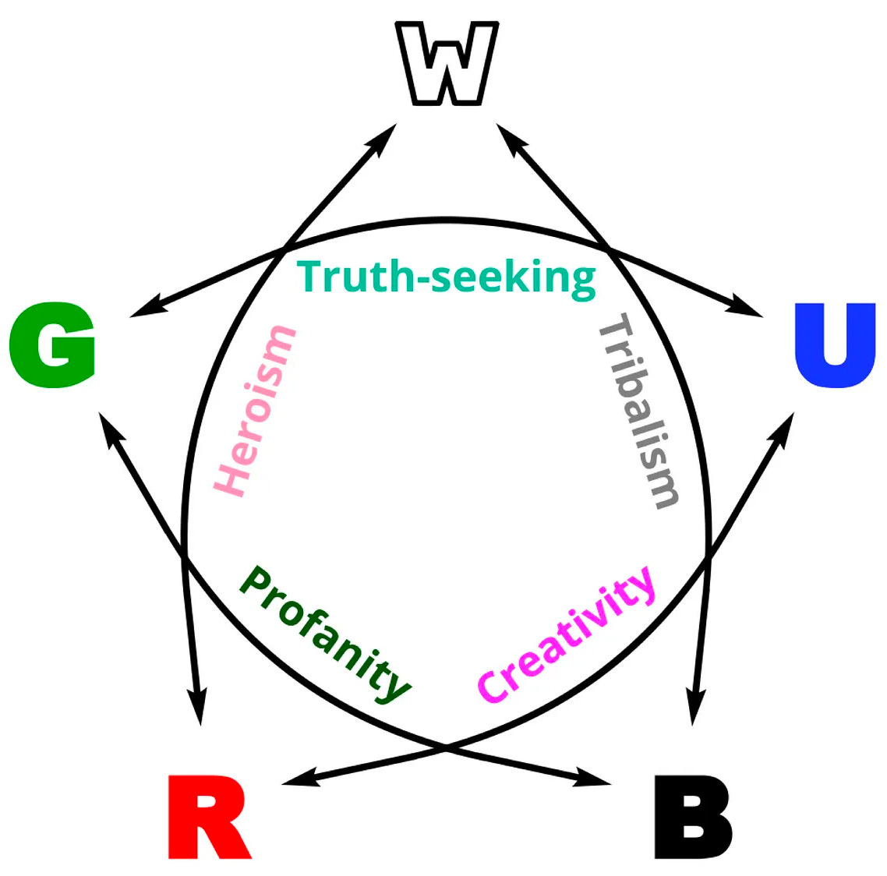

---

### Triple Major

Note that there’s nothing limiting color identities to one or two colors (indeed, from a certain perspective, the *goal* is to acquire *all* of the colors, to be able to see from every perspective and draw on every strength).

Captain America, for instance, is (appropriately) red/white/blue, and Dr. Jekyll swaps from blue/red to red/green as he transforms into Mr. Hyde (or possibly blue/black/red to red/black/green). I myself am green/blue with a strong splash of red, though I often find myself with *goals* and *roles* that lean white, such as running workshops or writing essays like this one.

Often, a person who’s three or more colors won’t draw evenly from all of them — for instance, someone who’s blue-black-red might identify heavily with blue-black’s growth mindset and red’s sense of presence and passion, but *not *particularly resonate with “creativity” or “independence.”

But for the sake of argument, you could imagine a balanced trio as [the sum of its two-color connections] and [the absence of whatever the two remaining colors agree upon]. Some slightly cheesy and horoscope-y examples below (note that the cheesiness is *because* I’m trying to describe a general archetype, rather than pulling from specific subsets of each color as I would with a real, narrow example):

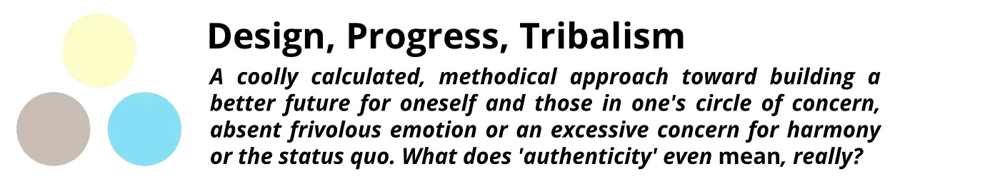

*“Esper”*

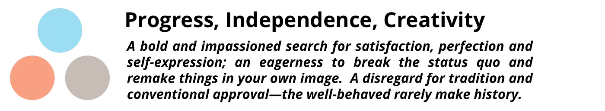

*“Grixis”*

*“Jund”*

*“Naya”*

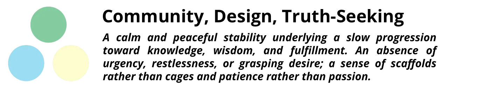

*“Bant”*

*“Mardu”*

*“Temur”*

*“Abzan”*

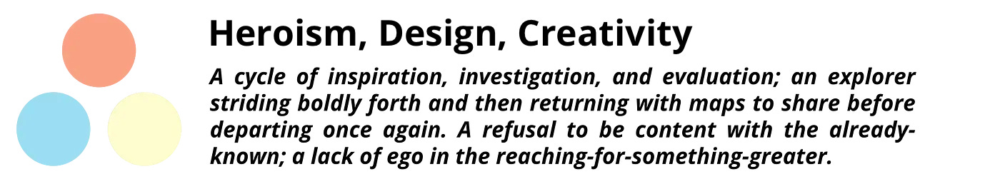

*“Jeskai”*

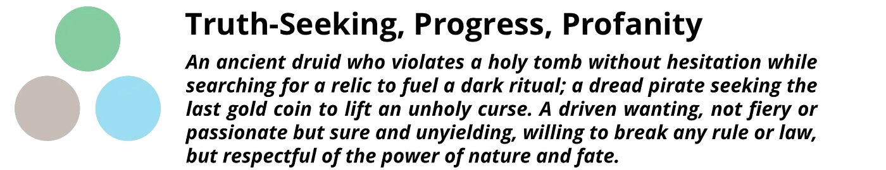

*“Sultai”*

Hopefully it’s easy to see how slight tweaks to make one color more prominent or another less crucial can result in a *lot* of different “flavors.”

Another important point is that, since each color is a large bucket and people are small and specific, a person who’s e.g. mono-red is not necessarily *less complex* than a person who’s e.g. green-blue. It just means that the red person drew *most* of their traits from that one bucket, whereas the multicolored person drew fewer traits from each of more buckets.

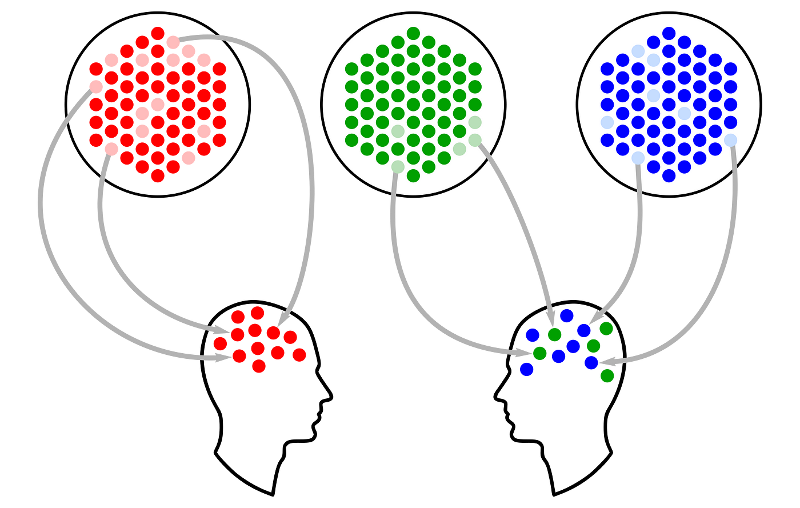

Beyond three colors, though, you start to lose the *point* of the color wheel, which is to serve as an intuition pump and a correlative, predictive archetype set. *All* people contain all five colors to one degree or another; *all* people are capable of acting from any combination. The point is not to say “Person X is red/white *and nothing else”* so much as it is to say “if we abstract away some of the detail at the tail ends of the graph, and treat Person X as if they’re a red/white archetype, how does that recontextualize our understanding of their behavior and motivations? What predictions does that allow us to make, about other traits they might have or how they’ll respond to various situations or stimuli?”

Obviously, it’s good to catch ‘em all, and to be able to paint with all the colors of the wheel, and to have in your own personal toolkit access to the strengths and perspectives of all five (just as it’s good to embody the virtues of every Hogwarts house, and to be able to access every chakra). But color identity isn’t about the sum total of what you *can and can’t do,* it’s about where you *tend to live.* Rarely do you see someone who *equally* embodies each of four or five colors, even though many people are capable of embodying any, in a pinch.

If you want a system that captures someone’s *full* essence, with all of the nuance and detail — well, you’re out of luck; I don’t think that system exists. But certainly there are things that try, like Big 5 analyses and MBTI. The color wheel is a more limited tool *on purpose*, just like sorting people into Hogwarts Houses (where you *have* to pick one).

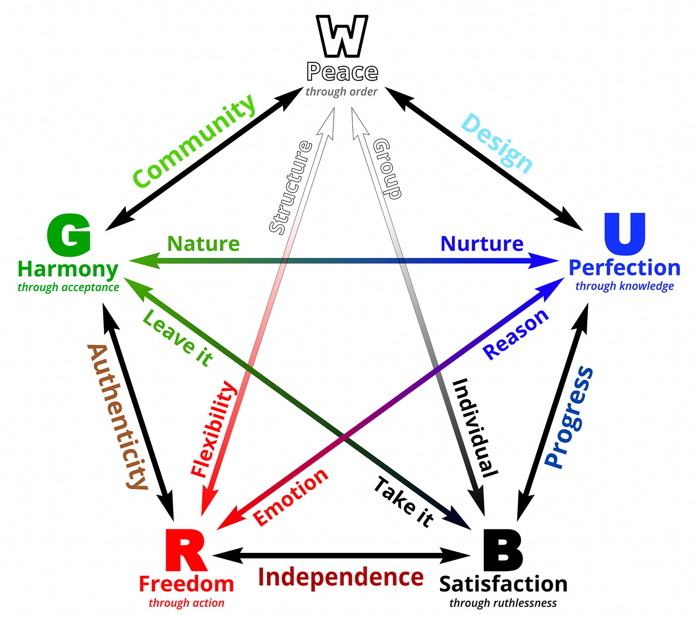

---

### Application

Okay, that’s the color wheel. Now what do we *do* with it?

In essence: classify things, and then make predictions based on those classifications.

By tentatively assigning things a color label (whether that thing be a whole person or a particular endeavor or even just a specific sentence), you can boot up a set of associations that allow you to prioritize your search-and-predict algorithms. The claim isn’t that a person who exhibits one aspect of redness will *definitely exhibit* all of the others, it’s that the bucket “red” is robust and trope-y and resonant enough that one red trait is *decent circumstantial evidence *of the existence of others.

(It’s worth noting that the colors speak largely to *goals *and* means.* Traits like “good” or “evil” do not map to the color wheel, since every color has ways in which it can be either. Similarly, emotions like love and hate can crop up in every color, as can characteristics like compassion or gregariousness or elegance — the difference is in how the colors *respond* to those emotions and those characteristics. All of the colors can feel strong emotion, but red responds to them by *following* them, while blue responds to them by *investigating *them. All of the colors can be polite, but white does so out of pro-sociality, whereas black does so transactionally.)

This is where I get the greatest benefit from the color wheel, myself — in interpreting *how and why* people have the reactions they have to various stimuli, and in predicting *what they’ll do next.*

For instance, I had a friend once who was suffering from a fairly serious bout of depression, to the point that they found themselves frequently having suicidal thoughts. Several of our mutual acquaintances had tried to help, in some fairly standard ways — they’d encouraged them to exercise regularly and try to repair their eating and sleeping habits, they’d tried to schedule regular visits to keep them company, and they’d asked them to commit to calling if things got particularly dark.

However, every single intervention just seemed to make things worse. My friend was chafing under every attempt to help, adding frustration and explosiveness to what was already a heavy emotional load.

What helped (for me) was connecting all of this anecdotal data to my prior, cached sense that this friend was *red.* Booting up my color wheel knowledge was a significant sense-making maneuver — suddenly, I had a *hypothesis *about what was going wrong. I realized that every attempted intervention had been orderly, structural — putting them on an exercise schedule, turning their life into a routine, forcing them into a *contract* that said that, in their most desperate and painful moments, they were *obligated* to pick up the phone and call — it was all white, white, white, white, white, and each new offer of help was like an additional bar being added to the cage.

The hypothesis generated a next action, too — I drove to their house, told them to get in my car, and started driving.

“Where are we going?” they asked.

“Dunno. Doesn’t matter. Any place you want to go?”

They were silent for a while. “Beach,” they said finally.

It’s not like this intervention fixed everything, of course. But it *did* make it better — that was a good day, for my friend, and in addition to the object level benefits of a day at the beach, I was able to *stop kicking them accidentally while they were down.*

A white character who’s depressed is going to want to do exercise routines and contracts-to-call.

A blue one is going to want to talk it over and figure out exactly what’s wrong.

A black one is going to want to take action — to regain locus of control.

A red one is going to want fewer constraints, and permission to just *feel*.

And a green one is going to be looking for ways to let go of the pain. To make peace with the parts of the situation they’re not going to be able to change.

The key recognition is that *all of these ways of being are okay.* They’re all good, they’re all evolved and refined, they’re all adaptive and workable.

But they’re *different. *If you’re blue/green and you walk around implicitly believing that everyone else is, too, you’re going to be *confused *and *disappointed* at how everyone is just *regularly* screwing up, and how they don’t even *notice* it.

If you’re mono-black, you’re going to see Machiavellian machinations *everywhere, *and you may not be able to tell the difference between someone trying to manipulate you and someone who’s actually just being their genuine self.

If you’re super red, you’re going to be confused as hell when your longtime partner starts talking about wanting to get married. If you’re hardcore white, you may not even be able to *tolerate* polyamory.

It’s all about perspective, and interpretation, and inference, and connotation. If I see someone staunchly defending the status quo, I boost my credence in a label of *green-white.* If I see someone vigorously defending their autonomy and freedom and refusing to make solid commitments, I tentatively tag them *red-black.* And these models help me to relate to people better on their own terms — to more rapidly understand their goals and motivations, to more accurately contextualize their actions, and to know which facet of my *own *personality to turn toward them.

In the end, it’s all shorthand, and clear-opinions-lightly-held. Learning the color system doesn’t really give me *new* information — it’s just an intuition pump, an extra library imported to my script. But like a good library, it gets me places a *lot *faster, and enables a lot more quick function calls than doing the whole thing in straight code.

My last anecdote is about how the color wheel broke me out of writer’s block — I’d been stuck at the same point in my then-one-quarter-finished novel for almost a year when I came across this framework, and I immediately sat down to try to classify all of my characters (as MTG game designer Mark Rosewater often does on his [blog](https://www.lesserwrong.com/posts/KbaJsfBtdpGv7EKbC/markrosewater.tumblr.com), where most of my understanding of this stuff comes from).

I was surprised to discover that, while I had an *immediate* stereotype about my second- and third-most important characters (red and white/blue/black, respectively) I had *no idea* what colors my main character was.

Thinking about it for an hour produced a decision (partly based on previous impressions, and partly *solidifying* and *crystallizing* those impressions) of green/blue, and I was off. I wrote thirty pages over the next two days, not to mention cleaning up a *bunch* of loose and random characterization.

There are other intuition pumps that do similar things for other people. Maybe I could’ve had the same breakthrough with word association or rolling dice or throwing darts at pictures of Robert Kegan. But of all the toy frameworks I’ve played with in my life, this is the one that keeps on giving. If I had to give you one, well — I didn’t *have* to, but this *is* the one I chose.

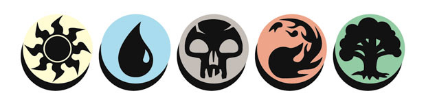

*The five mana symbols (™ and © Wizards of the Coast)*

## **Appendix**

A sampling of how one might use color wheel thinking:

- This person is suddenly upset, and I’m not sure why. Can I extrapolate from a sense of what color they are, to narrow the field of what sorts of things they might be defending?
- This project isn’t going well. Do we have too much or too little of a particular color, given the overall goal and method?
- I’m noticing an urge or desire or belief in myself that makes me uncomfortable. Can I ennoble it with a color label, such that it becomes okay to think about it and allow myself to have it within me?
- My friend keeps doing the same annoying thing over and over and over again. Can I get them to understand the reason it’s bothersome by pointing at the difference in our colors? Alternately, can I communicate to my System 1 that it’s not going to change because it’s close to their deep identity, and let go of my frustration and shift my [locus of control](https://www.lesserwrong.com/posts/4L5JQof2tfnjyaqSM/narrativemancy-locus-of-control)?
- Will these two people get along?
- Who should I introduce this person to?
- How would a ______ client react to this pitch? What about a ______ one?
- Oh, interesting. That comment sounds like a bid to get more ______ into the picture.
- Can I predict how this person’s colors will influence the way they do this project? Does that bring any extra clarifications or warnings or additional instructions to mind, before I turn them loose?
- I’m feeling dissatisfied and unfulfilled. What colors am I missing from my “diet,” which might recharge me?
- What sort of genre are we in right now? What kind of resolution will satisfy?
- I’m trying to grow as a person. What swath of person-territory do I want to try gaining next?
- What sort of present should I get my colleague for their birthday?
- I need to motivate this group, get them bought in and charged up. What sorts of things will I say? What sorts of things are likely to land flat?

Everything I write becomes free after a week or two, but it’s only *paid* subscriptions that make it *possible* for me to write. If you found anything of value in this or any of my other writing, please consider dropping a coffee’s-worth of money here; every bill I can pay with writing is a bill I *don’t* have to pay by doing other stuff instead.
